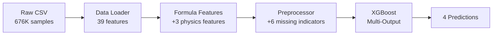

# ML Footprint Prediction Model

> Multi-output XGBoost model with physics-based constraints for predicting environmental footprints of fashion products

[](https://www.python.org/downloads/)
[](https://xgboost.readthedocs.io/)
[]()

---

## Table of Contents
- [Overview](#overview)
- [Key Features](#key-features)
- [Quick Start](#quick-start)
- [Architecture Deep Dive](#architecture-deep-dive)
- [Training Strategies](#training-strategies)
- [Output & Results](#output--results)
- [Troubleshooting](#troubleshooting)

---

## Overview

This model predicts **4 environmental footprint metrics** for fashion products using a **single multi-output XGBoost model** with built-in physics constraints:

| Target | Description | Unit |
|--------|-------------|------|
| `carbon_material` | Carbon footprint from materials | kg CO2e |
| `carbon_transport` | Carbon footprint from transportation | kg CO2e |
| `carbon_total` | Total carbon footprint | kg CO2e |
| `water_total` | Total water footprint | liters |

**Key Innovation**: The model enforces the physics relationship `carbon_total = carbon_material + carbon_transport` through a custom objective function during training, not just post-processing.

---

## Key Features

### Multi-Output with Physics Constraints
- **Single model** predicts all 4 targets simultaneously (vs 4 separate models)
- **Custom objective function** enforces physical consistency:
  ```
  Loss = MSE + λ × |carbon_total - (carbon_material + carbon_transport)|²
  ```
- **Typical constraint violation**: < 0.01 kg CO2e (effectively zero)

### 🧮 Formula Blending (Hybrid Approach)
- Calculates **physics-based formulas** from `data_calculations` module
- Adds formula predictions **as input features** to the ML model
- **Benefits**:
  - Uses formulas as baseline when data is complete
  - Learns from `category`, `gender` patterns to compensate for missing data
  - Handles core requirement: "predict footprints even with missing `total_distance_km`"

### Smart Missing Value Handling
- **Hierarchical indicators**:
  - **Critical**: `weight_kg_missing`, `total_distance_km_missing`, `materials_missing` (formula-dependent)
  - **Optional**: `category_missing`, `gender_missing` (less critical with formula baseline)
- Model learns patterns to compensate for missing values

### GPU Acceleration
- Optimized for NVIDIA GPUs using `tree_method='gpu_hist'`
- **10x faster** training on 676K samples (5-10 min vs 30-60 min on CPU)

---

## Quick Start

### Maximum Accuracy Training (Recommended)

**3-Phase automated pipeline** optimized for accuracy over cost:

```bash
cd /home/tr4moryp/Projects/bulk_product_generator/models

# Full training on 676K samples (GPU recommended)
python train_max_accuracy.py
```

**What happens automatically**:

#### Phase 1: Baseline Training (Complete Data)
- Trains on all 676K samples with **no missing values**
- Configuration optimized for accuracy:
  - 2000 boosting rounds (vs 500 standard)
  - Depth 12 trees (vs 8)
  - Learning rate 0.03 (slower = better convergence)
- **Target**: R² > 0.90, MAE < 0.10 kg CO2e

#### Phase 2: Evaluation & Robustness Testing
- Evaluates baseline performance on clean validation set
- Tests robustness with artificial missing values:
  - Creates 5 random trials at each missing level (0%, 10%, 20%, 30%, 40%, 50%)
  - Measures performance degradation
  - Generates plots (`robustness_curves.png`)
- **Decision gate**: Checks if retraining needed based on accuracy targets

#### Phase 3: Augmented Retraining (If Needed)
- **Triggers if**: Robustness at 30% missing doesn't meet R² > 0.80 target
- Retrains with artificial missing values in training data:
  - 15% samples: missing `weight_kg`
  - 25% samples: missing `total_distance_km`
  - 10% samples: missing `materials`
- Even more iterations: 2500 rounds, depth 14
- **Target**: R² > 0.80 with 30% missing data

**Expected Runtime**:
- Phase 1: 15-20 min (GPU) or 45-60 min (CPU)
- Phase 2: 10-15 min (robustness testing)
- Phase 3: 20-30 min if needed
- **Total**: ~30-60 min on GPU

### 🧪 Quick Test (Development)

Test on smaller dataset for rapid iteration:

```bash
# 10K samples, CPU mode
python train_max_accuracy.py --sample-size 10000 --tree-method hist

# Expected time: ~5 min
```

### Standard Training (Faster, Lower Accuracy)

For quick experiments (500 rounds instead of 2000):

```bash
python main.py --n-estimators 500
# Time: ~5-10 min GPU, ~15-30 min CPU
```

---

## Architecture Deep Dive

### Pipeline Flow



### Feature Engineering (48 Total Features)

| Category | Count | Details |
|----------|-------|---------|
| **Categorical** | 3 | `gender`, `parent_category`, `category` (label encoded) |
| **Numerical** | 2 | `weight_kg`, `total_distance_km` (scaled) |
| **Materials** | 34 | One-hot encoded percentages (already in CSV) |
| **Missing Indicators** | 6 | Binary flags for missing values |
| **Formula Features** | 3 | `formula_carbon_material`, `formula_carbon_transport`, `formula_water_total` |

### How Formula Features Work

**Emission factors** are loaded from:
```
/data/data_calculations/input/material_dataset_final.csv
```

**Calculation** (when data available):
```python
# Carbon from materials
formula_carbon_material = Σ(weight_kg × material_i% × carbon_factor_i)

# Carbon from transport  
formula_carbon_transport = (weight_kg/1000) × distance_km × (weighted_EF/1000)

# Water footprint
formula_water_total = Σ(weight_kg × material_i% × water_factor_i)
```

**When data missing**: Formula features = NaN (XGBoost handles natively)

**Model learns to**:
- Use formulas as strong baseline (complete data)
- Leverage `category`, `gender` patterns to estimate when missing
- Apply corrections based on additional context

---

## Training Strategies

### Maximum Accuracy (Priority: Accuracy > Cost)

**File**: `train_max_accuracy.py`

**Hyperparameters**:
```python
BASELINE_CONFIG = {
    'n_estimators': 2000,        # More trees
    'max_depth': 12,             # Deeper trees
    'learning_rate': 0.03,       # Slower learning
    'subsample': 0.9,            # More data per tree
    'lambda_weight': 0.1,        # Physics constraint
    'tree_method': 'gpu_hist'    # GPU
}
```

**Use when**: Final production model, maximum accuracy required

### Standard Training (Priority: Speed > Accuracy)

**File**: `main.py`

**Hyperparameters**:
```python
DEFAULT_CONFIG = {
    'n_estimators': 500,         # Fewer trees
    'max_depth': 8,              # Shallower
    'learning_rate': 0.05,       # Faster learning
    'subsample': 0.8,
    'lambda_weight': 0.1,
    'tree_method': 'gpu_hist'
}
```

**Use when**: Quick experiments, hyperparameter tuning, development

### CLI Options

Both scripts support:

```bash
--sample-size N          # Subsample for testing (default: all 676K)
--tree-method METHOD     # 'gpu_hist' or 'hist' (default: gpu_hist)
--lambda-weight F        # Physics constraint weight (default: 0.1)
--n-estimators N         # Boosting rounds
--learning-rate F        # Learning rate
--max-depth N            # Tree depth
--save-dir PATH          # Output directory
--seed N                 # Random seed (default: 42)
```

**Examples**:
```bash
# CPU training
python train_max_accuracy.py --tree-method hist

# Increase physics constraint
python train_max_accuracy.py --lambda-weight 0.2

# Force augmented retraining
python train_max_accuracy.py --force-augmentation
```

---

## Output & Results

### Saved Models

After training, models saved to:
```
saved/max_accuracy/
├── baseline/
│   ├── xgb_model.json           # XGBoost model
│   ├── trainer_config.pkl       # Training config
│   ├── preprocessor.pkl         # Fitted preprocessor
│   └── evaluation/
│       ├── baseline_predictions.csv
│       ├── robustness_results.csv
│       ├── robustness_curves.png
│       └── evaluation_report.json
└── robustness/                  # If Phase 3 ran
    └── ...
```

### Evaluation Plots

**`robustness_curves.png`**: Shows performance vs missing data percentage


### Logs

**Location**: `logs/training_max_accuracy.log`

**Contains**:
- Training progress (every 50 rounds)
- Validation metrics per target
- Physics constraint violations
- Phase transitions
- Accuracy target checks

**Example log output**:
```
2025-12-03 14:00:00 - Phase 1: BASELINE TRAINING
2025-12-03 14:00:01 - Training samples: 676,179
2025-12-03 14:00:01 - Validation samples: 225,394
...
[100] train-avg_mae: 0.0452  val-avg_mae: 0.0489
...
2025-12-03 14:15:23 - carbon_total | MAE: 0.0876 | R²: 0.9234
2025-12-03 14:15:23 - All accuracy targets met!
```

### Expected Performance

**Baseline (Complete Data)**:
- R² > 0.90 for all targets
- MAE < 0.10 kg CO2e (carbon)
- MAE < 150L (water)
- Constraint violation < 0.01

**Robustness (30% Missing)**:
- R² > 0.80 for all targets
- Performance degradation < 15%
- MAE < 0.15 kg CO2e (carbon)

---

## Troubleshooting

### GPU Not Detected

**Symptoms**: Training uses CPU despite `--tree-method gpu_hist`

**Solutions**:
```bash
# Check CUDA availability
python -c "import xgboost as xgb; print(xgb.dask.__version__)"

# Force CPU if GPU unavailable
python train_max_accuracy.py --tree-method hist
```

### Out of Memory

**Symptoms**: CUDA out of memory error during training

**Solutions**:
```bash
# Reduce sample size
python train_max_accuracy.py --sample-size 100000

# Use CPU
python train_max_accuracy.py --tree-method hist
```

### Low Baseline R²

**Symptoms**: Baseline R² < 0.80

**Solutions**:
1. Increase iterations: `--n-estimators 3000`
2. Tune learning rate: `--learning-rate 0.02`
3. Increase tree depth: `--max-depth 14`
4. Check data quality in logs

### Poor Robustness

**Symptoms**: R² drops significantly with missing values

**Expected**: Automatic Phase 3 retraining should trigger

**Manual trigger**:
```bash
python train_max_accuracy.py --force-augmentation
```

### Physics Constraint Violations

**Symptoms**: Constraint violation > 0.05 kg CO2e

**Solutions**:
1. Increase lambda: `--lambda-weight 0.2`
2. More iterations: `--n-estimators 3000`
3. Check logs for convergence issues

---

## Advanced Usage

### Hyperparameter Tuning

Edit `src/config.py` to customize:
- `BASELINE_CONFIG` - Complete data training
- `ROBUSTNESS_CONFIG` - Augmented training  
- `MISSING_AUGMENTATION` - Missing value probabilities
- `ACCURACY_TARGETS` - Success criteria

### Custom Evaluation

```python
from src.evaluator import ModelEvaluator
from src.trainer import FootprintModelTrainer

# Load trained model
trainer = FootprintModelTrainer.load('saved/max_accuracy/baseline')

# Custom evaluation
evaluator = ModelEvaluator('custom_eval/')
evaluator.test_missing_value_robustness(
    trainer, preprocessor, X_val_raw, y_val,
    missing_levels=[0.1, 0.3, 0.5, 0.7],  # Custom levels
    n_trials=10  # More trials for stability
)
```

### Batch Prediction

```python
import pandas as pd
from src.trainer import FootprintModelTrainer
from src.preprocessor import FootprintPreprocessor

# Load model
trainer = FootprintModelTrainer.load('saved/max_accuracy/baseline')
preprocessor = FootprintPreprocessor.load('saved/max_accuracy/baseline/preprocessor.pkl')

# Prepare new data
new_products = pd.read_csv('new_products.csv')
# ... add formula features and preprocess ...

# Predict
predictions = trainer.predict(new_products_processed)
print(predictions.head())
```

---

## Dependencies

```
pandas>=2.0.0
numpy>=1.24.0
scikit-learn>=1.3.0
xgboost>=2.0.0
matplotlib>=3.7.0
seaborn>=0.12.0
joblib>=1.3.0
```

**Install**:
```bash
pip install -r requirements.txt
```

---

## Project Structure

```
models/
├── src/
│   ├── __init__.py
│   ├── config.py              # Hyperparameter configs
│   ├── data_loader.py         # CSV loading (130 lines)
│   ├── formula_features.py    # Physics formulas (240 lines)
│   ├── preprocessor.py        # Feature engineering (250 lines)
│   ├── trainer.py             # XGBoost trainer (390 lines)
│   ├── evaluator.py           # Evaluation & testing (280 lines)
│   └── utils.py               # Helpers (50 lines)
├── saved/                     # Trained models
├── logs/                      # Training logs
├── main.py                    # Standard training (120 lines)
├── train_max_accuracy.py      # 3-phase pipeline (320 lines)
├── requirements.txt
└── README.md                  # This file
```

**Total**: ~1,800 lines of production code

---

## Citation

If you use this model, please cite:

```bibtex
@software{ml_footprint_model,
  title={Multi-Output XGBoost with Physics Constraints for Footprint Prediction},
  year={2025},
  author={Avelero},
  description={Hybrid ML model combining physics formulas with gradient boosting}
}
```

---

## Support

For issues or questions:
1. Check [Troubleshooting](#troubleshooting)  
2. Review logs in `logs/training_max_accuracy.log`
3. Examine evaluation reports in `saved/.../evaluation/`

---

**Ready to train?**
```bash
python train_max_accuracy.py
```
